# Enterprise AI Assistant — Engineering Specification

**Companion to:** [Architecture & Implementation Plan v6.0](file:///c:/workspace/enterprise_ai_assistant_implementation_plan_v4.md)  
**Purpose:** Concrete implementation contracts for Copilot-driven refactoring  
**Stack:** Python 3.11 · FastAPI · Azure SDK · OpenTelemetry  
**Conventions:** `async def` for I/O-bound · `def` for CPU-bound · `Depends()` for DI · `os.environ` for config  

---

# Part 1: Domain Model & Data Contracts

---

## 1. Domain Model

### 1.1 — Entity Relationship Diagram

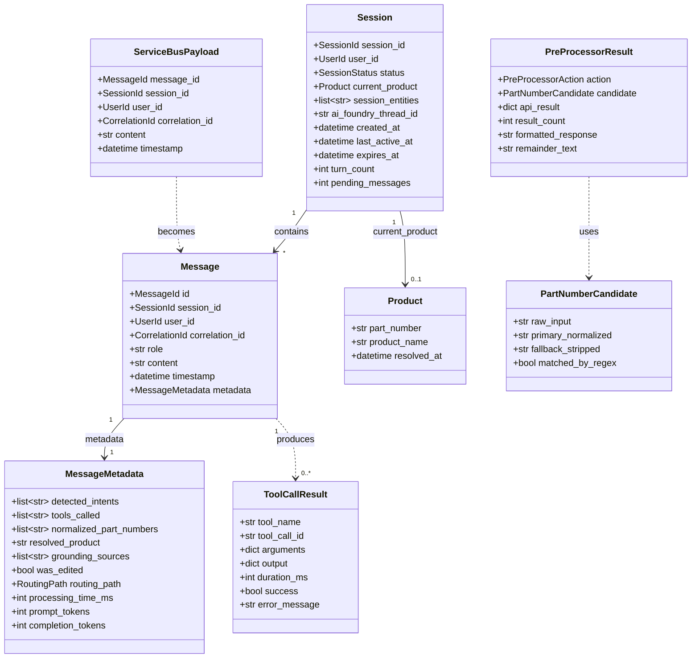

### 1.2 — Value Objects

These are typed aliases — never raw strings in business logic:

```python
from typing import NewType

SessionId = NewType("SessionId", str)       # UUID v4: "sess_abc123"
MessageId = NewType("MessageId", str)       # UUID v4: "msg_uuid_001"
UserId = NewType("UserId", str)             # Azure Entra OID: "entra_object_id_xyz"
CorrelationId = NewType("CorrelationId", str)  # UUID v4: "corr_gateway_001"
ThreadId = NewType("ThreadId", str)         # AI Foundry thread ID
RunId = NewType("RunId", str)               # AI Foundry run ID
```

### 1.3 — Enumerations

```python
from enum import StrEnum

class SessionStatus(StrEnum):
    ACTIVE = "active"
    EXPIRED = "expired"

class MessageRole(StrEnum):
    USER = "user"
    ASSISTANT = "assistant"

class RoutingPath(StrEnum):
    DETERMINISTIC = "deterministic"     # Resolved by pre-processor (no LLM)
    AI_FOUNDRY = "ai_foundry"           # Required LLM reasoning

class PreProcessorAction(StrEnum):
    RESOLVED = "resolved"               # Pre-processor fully handled the query
    DISAMBIGUATION = "disambiguation"   # Multiple matches — formatted question
    NOT_FOUND = "not_found"             # Zero results after all candidates
    FALLBACK_TO_LLM = "fallback_to_llm" # Pre-processor cannot handle — route to LLM
    OFF_TOPIC = "off_topic"             # Clearly off-topic — short circuit

class WebSocketMessageType(StrEnum):
    STATUS = "status"
    RESPONSE = "response"
    DISAMBIGUATION = "disambiguation"
    SESSION_EXPIRED = "session_expired"
    ERROR = "error"

class ProcessingStatus(StrEnum):
    QUEUED = "queued"
    PROCESSING = "processing"
    COMPLETED = "completed"
    ERROR = "error"

class ErrorCode(StrEnum):
    PRODUCT_API_TIMEOUT = "PRODUCT_API_TIMEOUT"
    GPT_API_TIMEOUT = "GPT_API_TIMEOUT"
    SEARCH_UNAVAILABLE = "SEARCH_UNAVAILABLE"
    AGENT_ERROR = "AGENT_ERROR"
    QUEUE_ERROR = "QUEUE_ERROR"
    SESSION_EXPIRED = "SESSION_EXPIRED"
    SESSION_NOT_FOUND = "SESSION_NOT_FOUND"
    VALIDATION_ERROR = "VALIDATION_ERROR"
    CIRCUIT_BREAKER_OPEN = "CIRCUIT_BREAKER_OPEN"
    INTERNAL_ERROR = "INTERNAL_ERROR"
```

---

## 2. Pydantic Models

### 2.1 — API Request Models

```python
# app/models/requests.py
from pydantic import BaseModel, Field
from typing import Optional

class CreateSessionRequest(BaseModel):
    """POST /api/v1/session/create — No body required.
    user_id comes from X-User-Id header (injected by APIM)."""
    pass

class SendMessageRequest(BaseModel):
    """POST /api/v1/chat/send"""
    session_id: str = Field(..., description="Active session ID")
    message: str = Field(..., min_length=1, max_length=4000,
                         description="User's chat message")
```

### 2.2 — API Response Models

```python
# app/models/responses.py
from pydantic import BaseModel
from typing import Optional
from datetime import datetime

class CreateSessionResponse(BaseModel):
    session_id: str
    ws_url: str  # wss:// URL for Web PubSub connection

class SendMessageResponse(BaseModel):
    message_id: str
    status: str = "queued"  # always "queued" on 202
    queue_position: int = 1

class ConversationHistoryResponse(BaseModel):
    session_id: str
    messages: list["MessageResponse"]

class MessageResponse(BaseModel):
    id: str
    role: str
    content: str
    timestamp: datetime
    metadata: Optional["MessageMetadataResponse"] = None

class MessageMetadataResponse(BaseModel):
    resolved_product: Optional[str] = None
    sources: list[str] = []
    tools_called: list[str] = []
    was_edited: bool = False

class HealthResponse(BaseModel):
    status: str = "healthy"
    version: str
    timestamp: datetime

class ErrorResponse(BaseModel):
    error: str
    error_code: str
    detail: Optional[str] = None
```

### 2.3 — Cosmos DB Document Models

```python
# app/models/db.py
from pydantic import BaseModel, Field
from typing import Optional
from datetime import datetime

class ProductContext(BaseModel):
    part_number: str
    product_name: str
    resolved_at: datetime

class SessionContextDocument(BaseModel):
    """Cosmos DB: session_context container. Partition key: /session_id"""
    id: str                                     # "ctx_{session_id}"
    session_id: str
    user_id: str
    status: str = "active"                      # SessionStatus
    current_product: Optional[ProductContext] = None
    session_entities: list[str] = Field(default_factory=list)
    ai_foundry_thread_id: Optional[str] = None  # null until first LLM-bound message
    created_at: datetime
    last_active_at: datetime
    expires_at: datetime
    turn_count: int = 0
    pending_messages: int = 0

class MessageMetadataDocument(BaseModel):
    detected_intents: list[str] = Field(default_factory=list)
    tools_called: list[str] = Field(default_factory=list)
    normalized_part_numbers: list[str] = Field(default_factory=list)
    resolved_product: Optional[str] = None
    grounding_sources: list[str] = Field(default_factory=list)
    was_edited: bool = False
    routing_path: str = "ai_foundry"            # RoutingPath
    processing_time_ms: int = 0
    prompt_tokens: int = 0
    completion_tokens: int = 0

class ConversationDocument(BaseModel):
    """Cosmos DB: conversations container. Partition key: /session_id"""
    id: str                                     # message_id
    session_id: str
    user_id: str
    correlation_id: str
    role: str                                   # MessageRole
    content: str
    timestamp: datetime
    metadata: Optional[MessageMetadataDocument] = None
```

### 2.4 — WebSocket Message Models (Server → Client via Web PubSub)

```python
# app/models/websocket.py
from pydantic import BaseModel
from typing import Optional
from datetime import datetime

class StatusMessage(BaseModel):
    type: str = "status"
    message_id: str
    status: str                                 # ProcessingStatus
    display_text: str = ""
    queue_position: Optional[int] = None        # only when status = "queued"
    timestamp: datetime

class ResponseMessage(BaseModel):
    type: str = "response"
    message_id: str
    content: str
    metadata: dict = {}                         # resolved_product, sources, etc.
    timestamp: datetime

class DisambiguationMessage(BaseModel):
    type: str = "disambiguation"
    message_id: str
    content: str = "I found multiple matches. Did you mean:"
    options: list["DisambiguationOption"]
    timestamp: datetime

class DisambiguationOption(BaseModel):
    part_number: str
    name: str

class SessionExpiredMessage(BaseModel):
    type: str = "session_expired"
    message: str = "Your session has expired due to inactivity."
    timestamp: datetime

class ErrorMessage(BaseModel):
    type: str = "error"
    message_id: str
    content: str
    error_code: str                             # ErrorCode
    timestamp: datetime
```

### 2.5 — Internal Models

```python
# app/models/internal.py
from pydantic import BaseModel
from typing import Optional
from datetime import datetime

class ServiceBusPayload(BaseModel):
    """Message payload enqueued to Azure Service Bus."""
    message_id: str
    session_id: str
    user_id: str
    correlation_id: str
    content: str
    timestamp: datetime

class PartNumberCandidate(BaseModel):
    """Result of regex-based part number extraction."""
    raw_input: str                              # original text matched: "LS - 12345"
    primary_normalized: str                     # "LS_12345"
    fallback_stripped: str                       # "LS12345"
    matched_by_regex: bool = True

class PreProcessorResult(BaseModel):
    """Result of the deterministic pre-processing step."""
    action: str                                 # PreProcessorAction
    candidate: Optional[PartNumberCandidate] = None
    api_result: Optional[dict] = None           # raw Product API response
    result_count: int = 0
    formatted_response: Optional[str] = None    # ready-to-send response (if resolved)
    remainder_text: Optional[str] = None        # non-part-number text for LLM

class ToolCallResult(BaseModel):
    """Result of executing a tool call from AI Foundry."""
    tool_name: str
    tool_call_id: str
    arguments: dict
    output: dict
    duration_ms: int
    success: bool
    error_message: Optional[str] = None
```

---

## 3. Configuration Reference

All configuration is read from environment variables via `os.environ`. A centralized `config.py` module provides typed access with defaults.

```python
# app/config.py
import os

# ──────────────────────────────────────────────
# Azure Entra ID
# ──────────────────────────────────────────────
AZURE_TENANT_ID = os.environ["AZURE_TENANT_ID"]
AZURE_CLIENT_ID = os.environ["AZURE_CLIENT_ID"]
AZURE_AUTHORITY = os.environ.get(
    "AZURE_AUTHORITY",
    f"https://login.microsoftonline.com/{AZURE_TENANT_ID}"
)

# ──────────────────────────────────────────────
# Azure APIM
# ──────────────────────────────────────────────
APIM_SUBSCRIPTION_KEY = os.environ["APIM_SUBSCRIPTION_KEY"]
APIM_GATEWAY_URL = os.environ["APIM_GATEWAY_URL"]

# ──────────────────────────────────────────────
# Azure AI Foundry
# ──────────────────────────────────────────────
AI_FOUNDRY_CONNECTION_STRING = os.environ["AI_FOUNDRY_CONNECTION_STRING"]
AI_FOUNDRY_ORCHESTRATOR_MODEL = os.environ.get("AI_FOUNDRY_ORCHESTRATOR_MODEL", "gpt-4o")
AI_FOUNDRY_EDITOR_MODEL = os.environ.get("AI_FOUNDRY_EDITOR_MODEL", "gpt-4o-mini")
ORCHESTRATOR_AGENT_ID = os.environ.get("ORCHESTRATOR_AGENT_ID", "")  # set after agent creation
EDITOR_AGENT_ID = os.environ.get("EDITOR_AGENT_ID", "")

# ──────────────────────────────────────────────
# Azure Cosmos DB
# ──────────────────────────────────────────────
COSMOS_DB_ENDPOINT = os.environ["COSMOS_DB_ENDPOINT"]
COSMOS_DB_DATABASE = os.environ.get("COSMOS_DB_DATABASE", "enterprise-ai-assistant")
COSMOS_CONVERSATIONS_CONTAINER = os.environ.get("COSMOS_CONVERSATIONS_CONTAINER", "conversations")
COSMOS_SESSION_CONTEXT_CONTAINER = os.environ.get("COSMOS_SESSION_CONTEXT_CONTAINER", "session_context")

# ──────────────────────────────────────────────
# Azure Service Bus
# ──────────────────────────────────────────────
SERVICE_BUS_NAMESPACE = os.environ["SERVICE_BUS_NAMESPACE"]
SERVICE_BUS_QUEUE_NAME = os.environ.get("SERVICE_BUS_QUEUE_NAME", "chat-queue")
SERVICE_BUS_MAX_DELIVERY_COUNT = int(os.environ.get("SERVICE_BUS_MAX_DELIVERY_COUNT", "3"))

# ──────────────────────────────────────────────
# Azure AI Search
# ──────────────────────────────────────────────
AI_SEARCH_ENDPOINT = os.environ["AI_SEARCH_ENDPOINT"]
AI_SEARCH_INDEX_NAME = os.environ.get("AI_SEARCH_INDEX_NAME", "product-knowledge-index")
AI_SEARCH_CONNECTION_ID = os.environ["AI_SEARCH_CONNECTION_ID"]

# ──────────────────────────────────────────────
# Azure Web PubSub
# ──────────────────────────────────────────────
WEB_PUBSUB_CONNECTION_STRING = os.environ["WEB_PUBSUB_CONNECTION_STRING"]
WEB_PUBSUB_HUB_NAME = os.environ.get("WEB_PUBSUB_HUB_NAME", "chat")

# ──────────────────────────────────────────────
# External APIs
# ──────────────────────────────────────────────
PRODUCT_DESCRIPTION_API_BASE_URL = os.environ["PRODUCT_DESCRIPTION_API_BASE_URL"]
PRODUCT_GPT_API_BASE_URL = os.environ["PRODUCT_GPT_API_BASE_URL"]

# ──────────────────────────────────────────────
# Session
# ──────────────────────────────────────────────
SESSION_TIMEOUT_MINUTES = int(os.environ.get("SESSION_TIMEOUT_MINUTES", "10"))
CONTEXT_OPTIMIZATION_TURN_THRESHOLD = int(os.environ.get("CONTEXT_OPTIMIZATION_TURN_THRESHOLD", "10"))

# ──────────────────────────────────────────────
# Resilience
# ──────────────────────────────────────────────
PRODUCT_API_TIMEOUT_SECONDS = int(os.environ.get("PRODUCT_API_TIMEOUT_SECONDS", "10"))
PRODUCT_API_RETRY_COUNT = int(os.environ.get("PRODUCT_API_RETRY_COUNT", "3"))
PRODUCT_GPT_TIMEOUT_SECONDS = int(os.environ.get("PRODUCT_GPT_TIMEOUT_SECONDS", "15"))
PRODUCT_GPT_RETRY_COUNT = int(os.environ.get("PRODUCT_GPT_RETRY_COUNT", "2"))
AI_FOUNDRY_TIMEOUT_SECONDS = int(os.environ.get("AI_FOUNDRY_TIMEOUT_SECONDS", "30"))
CIRCUIT_BREAKER_FAIL_MAX = int(os.environ.get("CIRCUIT_BREAKER_FAIL_MAX", "5"))
CIRCUIT_BREAKER_RESET_TIMEOUT = int(os.environ.get("CIRCUIT_BREAKER_RESET_TIMEOUT", "30"))

# ──────────────────────────────────────────────
# Observability
# ──────────────────────────────────────────────
APPLICATIONINSIGHTS_CONNECTION_STRING = os.environ.get("APPLICATIONINSIGHTS_CONNECTION_STRING", "")
OTEL_SERVICE_NAME = os.environ.get("OTEL_SERVICE_NAME", "enterprise-ai-assistant")
OTEL_TRACES_SAMPLER_ARG = float(os.environ.get("OTEL_TRACES_SAMPLER_ARG", "1.0"))

# ──────────────────────────────────────────────
# Scaling
# ──────────────────────────────────────────────
AUTOSCALE_MIN_INSTANCES = int(os.environ.get("AUTOSCALE_MIN_INSTANCES", "1"))
AUTOSCALE_MAX_INSTANCES = int(os.environ.get("AUTOSCALE_MAX_INSTANCES", "5"))
AUTOSCALE_QUEUE_THRESHOLD = int(os.environ.get("AUTOSCALE_QUEUE_THRESHOLD", "10"))

# ──────────────────────────────────────────────
# App
# ──────────────────────────────────────────────
APP_HOST = os.environ.get("APP_HOST", "0.0.0.0")
APP_PORT = int(os.environ.get("APP_PORT", "8000"))
APP_VERSION = os.environ.get("APP_VERSION", "1.0.0")
```

> **Convention:** Required env vars use `os.environ["VAR"]` (raises `KeyError` on missing). Optional env vars with defaults use `os.environ.get("VAR", "default")`.

---

# Part 2: Interface Contracts & Class Architecture

---

## 4. Repository & Service Interfaces

All external dependencies are abstracted behind `Protocol` classes. This enables:
- Easy mocking in unit tests
- Swapping implementations without changing business logic
- Clear contracts for Copilot to implement against

### 4.1 — Session Repository

```python
# app/db/protocols.py
from typing import Protocol, Optional
from app.models.db import SessionContextDocument

class ISessionRepository(Protocol):
    """Contract for session_context container operations."""

    async def create(self, doc: SessionContextDocument) -> None:
        """Create a new session_context document."""
        ...

    async def get(self, session_id: str) -> Optional[SessionContextDocument]:
        """Get session_context by session_id. Returns None if not found."""
        ...

    async def update(self, session_id: str, updates: dict) -> None:
        """Partial update of session_context fields.
        Uses Cosmos DB patch operations for efficiency.
        Example: update("sess_123", {"turn_count": 5, "last_active_at": now})
        """
        ...

    async def get_expired_sessions(self) -> list[SessionContextDocument]:
        """Query sessions where expires_at < now AND status = 'active'."""
        ...

    async def increment_pending(self, session_id: str) -> int:
        """Atomically increment pending_messages. Returns new value."""
        ...

    async def decrement_pending(self, session_id: str) -> int:
        """Atomically decrement pending_messages. Returns new value."""
        ...
```

### 4.2 — Conversation Repository

```python
class IConversationRepository(Protocol):
    """Contract for conversations container operations."""

    async def save_message(self, doc: "ConversationDocument") -> None:
        """Save a single message (user or assistant)."""
        ...

    async def get_history(self, session_id: str, limit: int = 50) -> list["ConversationDocument"]:
        """Get conversation history ordered by timestamp.
        Returns most recent `limit` messages.
        """
        ...
```

### 4.3 — Queue Service

```python
class IQueueService(Protocol):
    """Contract for Azure Service Bus operations."""

    async def enqueue(self, payload: "ServiceBusPayload") -> None:
        """Enqueue a message to the chat-queue.
        Uses Service Bus sessions (session_id) for FIFO ordering.
        """
        ...

    async def dequeue(self) -> Optional["ServiceBusPayload"]:
        """Dequeue the next message. Acquires a session lock.
        Returns None if no messages available.
        """
        ...

    async def complete(self, message: "ServiceBusPayload") -> None:
        """Mark message as successfully processed. Releases lock."""
        ...

    async def dead_letter(self, message: "ServiceBusPayload", reason: str) -> None:
        """Move message to DLQ."""
        ...
```

### 4.4 — PubSub Publisher

```python
class IPubSubPublisher(Protocol):
    """Contract for Azure Web PubSub push operations."""

    async def send_status(self, session_id: str, message_id: str,
                          status: str, display_text: str = "",
                          queue_position: Optional[int] = None) -> None:
        """Push a status update to the session's WebSocket group."""
        ...

    async def send_response(self, session_id: str, message_id: str,
                            content: str, metadata: dict = {}) -> None:
        """Push the final response to the session's WebSocket group."""
        ...

    async def send_disambiguation(self, session_id: str, message_id: str,
                                   options: list[dict]) -> None:
        """Push a disambiguation question with candidate options."""
        ...

    async def send_error(self, session_id: str, message_id: str,
                         content: str, error_code: str) -> None:
        """Push an error message."""
        ...

    async def send_session_expired(self, session_id: str) -> None:
        """Push a session expiration notification."""
        ...

    async def generate_client_token(self, user_id: str,
                                     session_id: str) -> str:
        """Generate a Web PubSub client access URL (wss://)."""
        ...
```

### 4.5 — AI Foundry Client

```python
class IAIFoundryClient(Protocol):
    """Contract for Azure AI Foundry Agent Service operations."""

    async def create_thread(self) -> str:
        """Create a new AI Foundry Thread. Returns thread_id."""
        ...

    async def create_message(self, thread_id: str, role: str, content: str) -> None:
        """Add a message to a Thread."""
        ...

    async def create_run(self, thread_id: str, agent_id: str) -> "RunResult":
        """Start a Run on a Thread. Blocks until completion or requires_action."""
        ...

    async def submit_tool_outputs(self, thread_id: str, run_id: str,
                                   tool_outputs: list[dict]) -> "RunResult":
        """Submit tool call results and continue the Run."""
        ...

    async def list_messages(self, thread_id: str) -> list[dict]:
        """List all messages in a Thread."""
        ...

    async def delete_thread(self, thread_id: str) -> None:
        """Delete a Thread (cleanup on session expiry)."""
        ...
```

### 4.6 — External API Clients

```python
class IProductAPI(Protocol):
    """Contract for the existing Product Description REST API."""

    async def lookup(self, part_number: str) -> dict:
        """GET /v1/products/{part_number}
        Returns product details dict or {"results": [], "count": 0} if not found.
        Raises ExternalServiceError on timeout/5xx.
        """
        ...

class IProductGPTAPI(Protocol):
    """Contract for the existing Product GPT AI API."""

    async def query(self, question: str) -> dict:
        """POST /api/v1/ask with {"query": question}
        Returns AI-generated answer dict.
        Raises ExternalServiceError on timeout/5xx.
        """
        ...
```

### 4.7 — Pre-Processor

```python
class IPreProcessor(Protocol):
    """Contract for the deterministic pre-processing layer."""

    def extract_part_number(self, text: str) -> Optional["PartNumberCandidate"]:
        """CPU-bound: regex scan for part number patterns.
        Returns None if no match. Sync because it's pure CPU.
        """
        ...

    def normalize(self, raw: str) -> "PartNumberCandidate":
        """CPU-bound: normalize a raw part number string.
        Sync because it's pure string manipulation.
        """
        ...

    async def process(self, message: str,
                      session_context: "SessionContextDocument") -> "PreProcessorResult":
        """Full pre-processing pipeline:
        1. Regex scan (sync/CPU)
        2. If match → normalize (sync/CPU)
        3. If match → call Product API (async/IO)
        4. Return result with action indicator
        """
        ...
```

---

## 5. Class Diagrams

### 5.1 — Gateway Layer

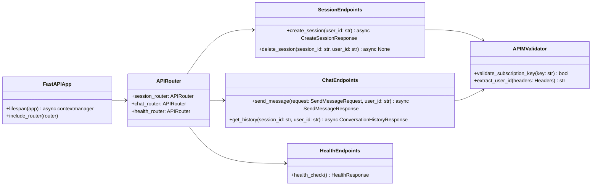

### 5.2 — Worker Layer

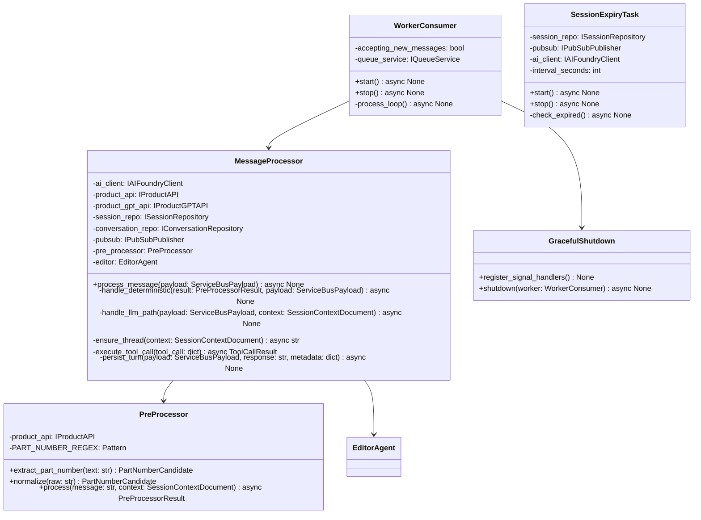

### 5.3 — Agent Layer

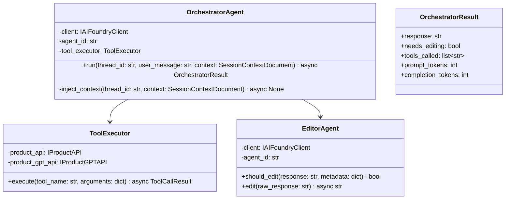

### 5.4 — Resilience Layer

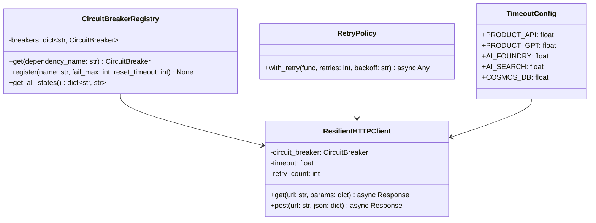

### 5.5 — Observability Layer

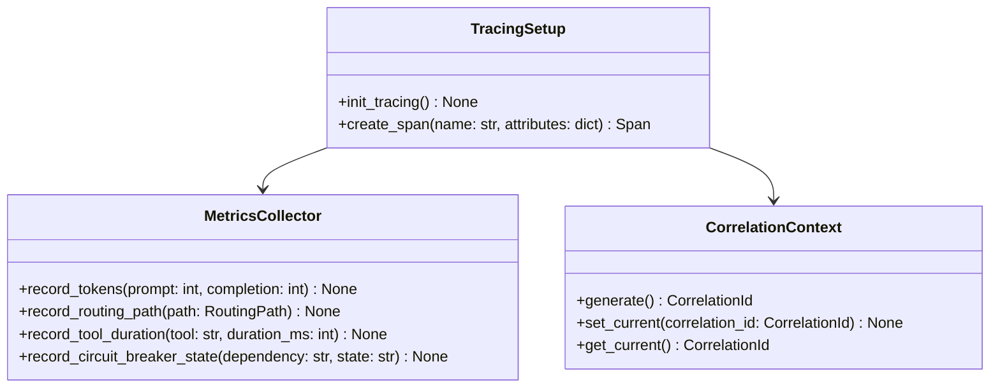

---

## 6. Module Ownership Matrix

| Module | Owns | May Import | Must NOT Import |
|--------|------|-----------|----------------|
| `app/api/` | REST endpoint handlers, request validation | `models`, `services`, `auth`, `pubsub` | `worker`, `agents`, `db` directly |
| `app/auth/` | APIM subscription key validation, user ID extraction | `config` | Everything else |
| `app/worker/` | Service Bus consumer, pre-processing, message processing, graceful shutdown | `models`, `agents`, `db`, `pubsub`, `resilience`, `observability`, `config` | `api` |
| `app/agents/` | AI Foundry client wrapper, orchestrator/editor logic, tool execution, system prompts | `models`, `resilience`, `config` | `api`, `worker`, `db` |
| `app/db/` | Cosmos DB client, CRUD for conversations & session_context | `models`, `config` | `api`, `worker`, `agents` |
| `app/pubsub/` | Web PubSub client, message push helpers | `models`, `config` | `api`, `worker`, `agents`, `db` |
| `app/resilience/` | Circuit breakers, retry policies, timeout configs | `config`, `observability` | `api`, `worker`, `agents`, `db` |
| `app/observability/` | OpenTelemetry setup, custom spans/metrics, correlation ID | `config` | Everything else |
| `app/services/` | Business logic: session lifecycle, queue enqueue/dequeue | `models`, `db`, `pubsub`, `config` | `api`, `worker`, `agents` |
| `app/models/` | Pydantic models, enums, type aliases | Nothing (leaf module) | Everything |
| `app/config.py` | Environment variable access | `os` only | Everything |

**Dependency Direction Rule:** Dependencies flow downward. Upper layers import lower layers. Never import upward.

```
api/  →  services/  →  db/
  ↓         ↓          ↓
worker/ → agents/ → resilience/ → observability/ → models/ → config.py
  ↓
pubsub/
```

---

# Part 3: Behavioral Contracts

---

## 7. State Machines

### 7.1 — Session Lifecycle

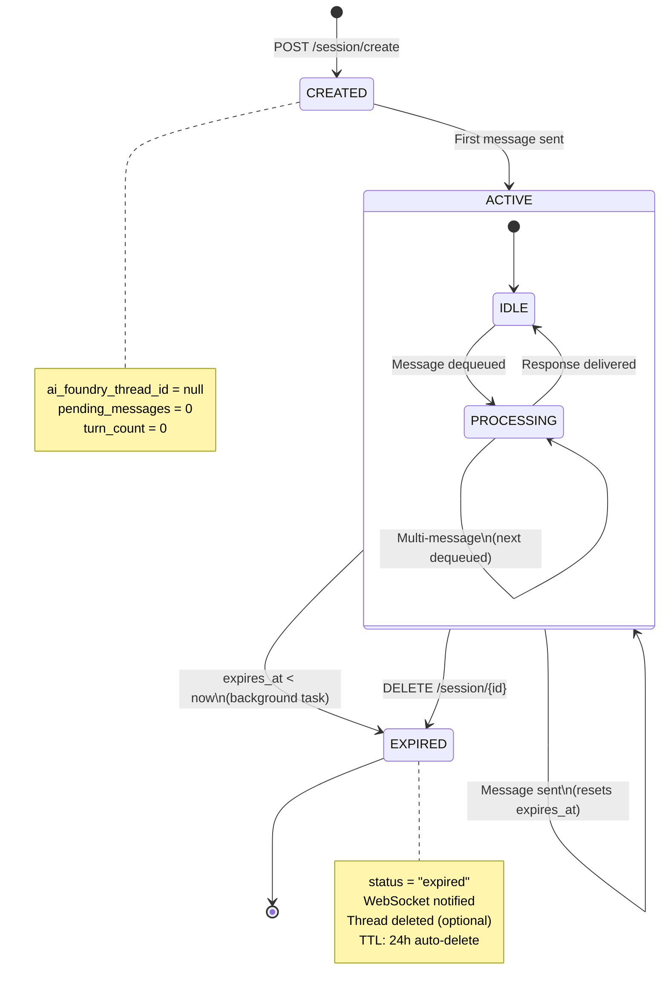

### 7.2 — Message Processing Pipeline

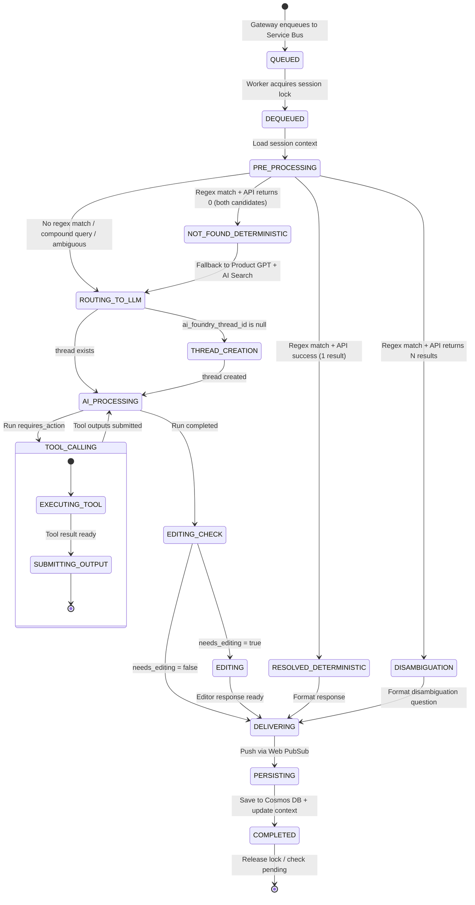

### 7.3 — Circuit Breaker

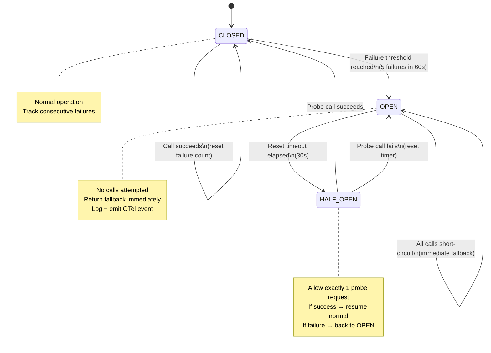

---

## 8. Sequence Diagrams

### 8.1 — Happy Path: Single Part Number (Deterministic Pre-Processing)

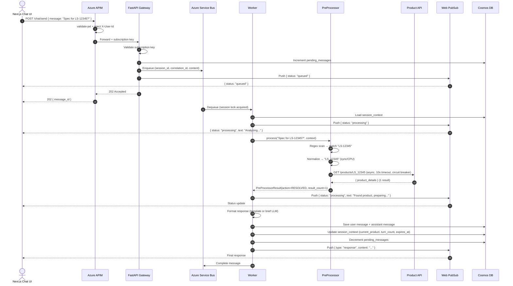

### 8.2 — Fallback Path: Product API → 0 Results → Product GPT + AI Search

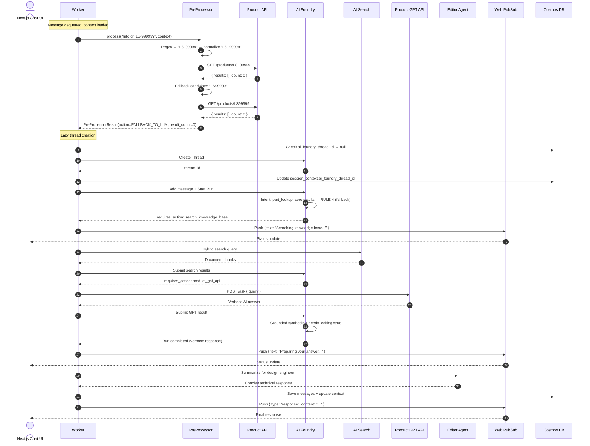

### 8.3 — Graceful Shutdown During Scale-Down

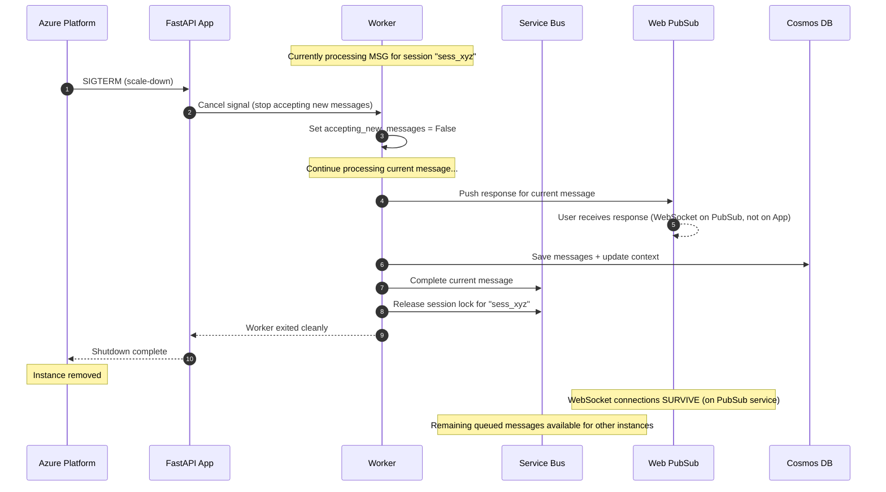

### 8.4 — Multi-Message FIFO Queuing

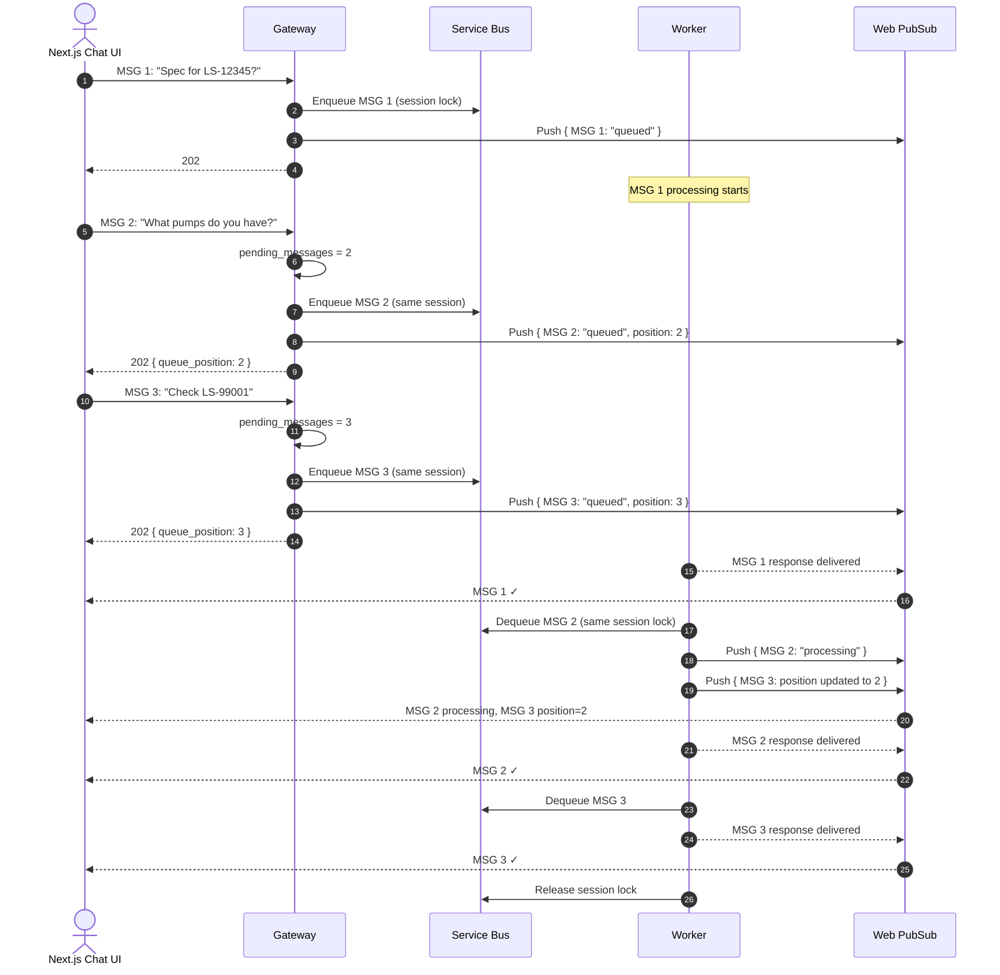

---

## 9. Exception Hierarchy

```python
# app/exceptions.py

class AppError(Exception):
    """Base exception for all application errors."""
    def __init__(self, message: str, error_code: str, status_code: int = 500):
        self.message = message
        self.error_code = error_code
        self.status_code = status_code
        super().__init__(message)


# ── Authentication & Authorization ──

class AuthenticationError(AppError):
    """APIM subscription key validation failed."""
    def __init__(self, message: str = "Unauthorized"):
        super().__init__(message, "UNAUTHORIZED", 401)


# ── Session Errors ──

class SessionError(AppError):
    """Base for session-related errors."""
    pass

class SessionNotFoundError(SessionError):
    """Session does not exist."""
    def __init__(self, session_id: str):
        super().__init__(
            f"Session '{session_id}' not found",
            "SESSION_NOT_FOUND", 404
        )

class SessionExpiredError(SessionError):
    """Session has expired due to inactivity."""
    def __init__(self, session_id: str):
        super().__init__(
            f"Session '{session_id}' has expired",
            "SESSION_EXPIRED", 410
        )

class SessionOwnershipError(SessionError):
    """User does not own this session."""
    def __init__(self):
        super().__init__(
            "You do not have access to this session",
            "SESSION_FORBIDDEN", 403
        )


# ── Validation Errors ──

class MessageValidationError(AppError):
    """Invalid message content."""
    def __init__(self, detail: str):
        super().__init__(detail, "VALIDATION_ERROR", 422)


# ── External Service Errors ──

class ExternalServiceError(AppError):
    """Base for errors from external dependencies."""
    def __init__(self, service: str, message: str, error_code: str):
        super().__init__(
            f"{service}: {message}",
            error_code, 502
        )

class ProductAPIError(ExternalServiceError):
    """Product Description API failure."""
    def __init__(self, message: str = "Product API unavailable"):
        super().__init__("Product Description API", message, "PRODUCT_API_TIMEOUT")

class ProductGPTError(ExternalServiceError):
    """Product GPT API failure."""
    def __init__(self, message: str = "Product GPT API unavailable"):
        super().__init__("Product GPT API", message, "GPT_API_TIMEOUT")

class AIFoundryError(ExternalServiceError):
    """Azure AI Foundry Agent error."""
    def __init__(self, message: str = "AI agent processing error"):
        super().__init__("AI Foundry", message, "AGENT_ERROR")

class SearchServiceError(ExternalServiceError):
    """Azure AI Search error."""
    def __init__(self, message: str = "Search service unavailable"):
        super().__init__("AI Search", message, "SEARCH_UNAVAILABLE")

class PubSubError(ExternalServiceError):
    """Azure Web PubSub push error."""
    def __init__(self, message: str = "WebSocket push failed"):
        super().__init__("Web PubSub", message, "PUBSUB_ERROR")


# ── Resilience Errors ──

class CircuitBreakerOpenError(AppError):
    """Circuit breaker is OPEN — calls blocked."""
    def __init__(self, dependency: str):
        super().__init__(
            f"Circuit breaker OPEN for {dependency}. Service temporarily unavailable.",
            "CIRCUIT_BREAKER_OPEN", 503
        )

class ServiceTimeoutError(AppError):
    """External service did not respond within timeout."""
    def __init__(self, service: str, timeout_seconds: int):
        super().__init__(
            f"{service} did not respond within {timeout_seconds}s",
            f"{service.upper().replace(' ', '_')}_TIMEOUT", 504
        )


# ── Queue Errors ──

class QueueError(AppError):
    """Service Bus processing error."""
    def __init__(self, message: str = "Message processing failed"):
        super().__init__(message, "QUEUE_ERROR", 500)
```

### Exception-to-HTTP Mapping (FastAPI Exception Handler)

```python
# app/api/error_handlers.py
from fastapi import FastAPI, Request
from fastapi.responses import JSONResponse
from app.exceptions import AppError

def register_error_handlers(app: FastAPI) -> None:
    @app.exception_handler(AppError)
    async def app_error_handler(request: Request, exc: AppError) -> JSONResponse:
        return JSONResponse(
            status_code=exc.status_code,
            content={
                "error": exc.message,
                "error_code": exc.error_code,
            }
        )
```

### Exception-to-WebSocket Mapping

When an exception occurs during Worker message processing, the Worker catches it and maps to a WebSocket error message:

| Exception | WebSocket `error_code` | User-Facing Message |
|-----------|----------------------|---------------------|
| `ProductAPIError` | `PRODUCT_API_TIMEOUT` | "Unable to retrieve product details right now. Please try again." |
| `ProductGPTError` | `GPT_API_TIMEOUT` | "Unable to access product information. Please try again." |
| `AIFoundryError` | `AGENT_ERROR` | "I encountered an issue processing your request. Please try again." |
| `SearchServiceError` | `SEARCH_UNAVAILABLE` | "Knowledge base temporarily unavailable. Answering from other sources." |
| `CircuitBreakerOpenError` | `CIRCUIT_BREAKER_OPEN` | "Service temporarily unavailable. Please try again in a moment." |
| `ServiceTimeoutError` | Varies by service | "Service did not respond in time. Please try again." |
| Any unhandled exception | `INTERNAL_ERROR` | "Something went wrong. Please try again." |

---

# Part 4: Engineering Standards

---

## 10. Coding Standards

### 10.1 — Async vs. Sync Rules

| Pattern | Use | Example |
|---------|-----|---------|
| `async def` | Any I/O operation: HTTP calls, Cosmos DB, Service Bus, Web PubSub, AI Foundry | `async def lookup(self, part_number: str) -> dict:` |
| `def` (sync) | CPU-bound logic: regex matching, string normalization, data formatting, template rendering | `def normalize(self, raw: str) -> PartNumberCandidate:` |
| `await` | Call async functions | `result = await self.product_api.lookup("LS_12345")` |
| `asyncio.create_task` | Background tasks (worker loop, session expiry) | `worker_task = asyncio.create_task(worker_loop())` |

> **Never use `asyncio.run()` inside an async context.** Use `await` instead. `asyncio.run()` is only for the entry point (`main.py`).

### 10.2 — Naming Conventions

| Element | Convention | Example |
|---------|-----------|---------|
| Files | `snake_case.py` | `session_context.py`, `circuit_breaker.py` |
| Classes | `PascalCase` | `MessageProcessor`, `PreProcessorResult` |
| Functions/Methods | `snake_case` | `extract_part_number()`, `send_status()` |
| Constants | `UPPER_SNAKE_CASE` | `PART_NUMBER_REGEX`, `SESSION_TIMEOUT_MINUTES` |
| Private methods | `_leading_underscore` | `_process_loop()`, `_execute_tool_call()` |
| Type aliases | `PascalCase` via `NewType` | `SessionId`, `CorrelationId` |
| Enum members | `UPPER_SNAKE_CASE` | `SessionStatus.ACTIVE` |

### 10.3 — Import Ordering

```python
# 1. Standard library
import os
import re
import asyncio
from datetime import datetime, timedelta
from typing import Optional, Protocol
from enum import StrEnum
from contextlib import asynccontextmanager

# 2. Third-party libraries
import httpx
import pybreaker
from tenacity import retry, stop_after_attempt, wait_exponential
from fastapi import FastAPI, Depends, HTTPException, Header, Request
from pydantic import BaseModel, Field

# 3. Azure SDK
from azure.identity import DefaultAzureCredential
from azure.ai.projects import AIProjectClient
from azure.servicebus.aio import ServiceBusClient
from azure.cosmos.aio import CosmosClient
from azure.messaging.webpubsubservice import WebPubSubServiceClient

# 4. OpenTelemetry
from opentelemetry import trace
from opentelemetry.sdk.trace import TracerProvider

# 5. Local application
from app import config
from app.models.db import SessionContextDocument, ConversationDocument
from app.models.requests import SendMessageRequest
from app.exceptions import ProductAPIError, SessionNotFoundError
```

### 10.4 — Docstrings (Google Style)

```python
async def process_message(self, payload: ServiceBusPayload) -> None:
    """Process a single dequeued message through the full pipeline.

    Steps:
        1. Load session context from Cosmos DB
        2. Run deterministic pre-processing (regex + direct API)
        3. If not resolved → route to AI Foundry (with lazy thread creation)
        4. If edited → run through Editor Agent
        5. Persist turn and deliver response via Web PubSub

    Args:
        payload: The deserialized Service Bus message containing
            session_id, message_id, correlation_id, and content.

    Raises:
        SessionNotFoundError: If session_context does not exist.
        SessionExpiredError: If session has expired during processing.
        QueueError: If message cannot be processed after all retries.
    """
```

### 10.5 — Error Handling Rules

```python
# ✅ CORRECT: Specific exception with context
try:
    result = await self.product_api.lookup(part_number)
except httpx.TimeoutException:
    raise ProductAPIError(f"Timeout looking up {part_number}")
except httpx.HTTPStatusError as e:
    raise ProductAPIError(f"HTTP {e.response.status_code} for {part_number}")

# ❌ WRONG: Bare except
try:
    result = await self.product_api.lookup(part_number)
except:
    pass

# ❌ WRONG: Catching Exception broadly
try:
    result = await self.product_api.lookup(part_number)
except Exception:
    return None

# ✅ CORRECT: Circuit breaker wrapping
try:
    result = await self._call_with_breaker("product_api", self.product_api.lookup, part_number)
except CircuitBreakerOpenError as e:
    logger.warning(f"Circuit breaker open: {e.message}")
    await self.pubsub.send_error(session_id, message_id,
        "Product lookup temporarily unavailable.", "CIRCUIT_BREAKER_OPEN")
```

### 10.6 — Dependency Injection (FastAPI `Depends()`)

```python
# app/dependencies.py
from fastapi import Depends, Header, HTTPException
from app import config

async def get_user_id(x_user_id: str = Header(..., alias="X-User-Id")) -> str:
    """Extract user_id from APIM-injected header."""
    if not x_user_id:
        raise HTTPException(status_code=401, detail="Missing X-User-Id header")
    return x_user_id

async def validate_apim(
    ocp_apim_subscription_key: str = Header(..., alias="Ocp-Apim-Subscription-Key")
) -> None:
    """Validate that request came through APIM."""
    if ocp_apim_subscription_key != config.APIM_SUBSCRIPTION_KEY:
        raise HTTPException(status_code=401, detail="Invalid subscription key")

# Usage in endpoint:
@router.post("/api/v1/chat/send")
async def send_message(
    request: SendMessageRequest,
    user_id: str = Depends(get_user_id),
    _: None = Depends(validate_apim),
) -> SendMessageResponse:
    ...
```

### 10.7 — Logging

```python
# ✅ CORRECT: Structured logging via OpenTelemetry / Python logging
import logging
logger = logging.getLogger(__name__)

logger.info("Message processed",
    extra={
        "session_id": session_id,
        "message_id": message_id,
        "routing_path": "deterministic",
        "duration_ms": 245
    })

# ❌ WRONG: print statements
print(f"Processing message {message_id}")

# ❌ WRONG: unstructured logging
logger.info(f"Processing message {message_id} for session {session_id}")
```

### 10.8 — Configuration Access

```python
# ✅ CORRECT: Import from config module
from app import config

timeout = config.PRODUCT_API_TIMEOUT_SECONDS
url = f"{config.PRODUCT_DESCRIPTION_API_BASE_URL}/products/{part_number}"

# ❌ WRONG: Direct os.environ in business logic
timeout = int(os.environ.get("PRODUCT_API_TIMEOUT_SECONDS", "10"))

# ❌ WRONG: Hardcoded values
timeout = 10
url = f"https://api.company.com/v1/products/{part_number}"
```

> `os.environ` access is centralized in `app/config.py` only. All other modules import from `config`.

---

## 11. Testing Strategy

### 11.1 — Test Pyramid

| Level | Scope | Runner | External Dependencies | Count Target |
|-------|-------|--------|----------------------|------|
| **Unit** | Single function/class | `pytest` | All mocked (Protocol-based) | ~80% of tests |
| **Integration** | Module interactions | `pytest` + Cosmos DB emulator | Emulators / test doubles | ~15% of tests |
| **E2E** | Full flow | `pytest` + real Azure (staging) | Real services | ~5% of tests |

### 11.2 — Test Naming Convention

```
test_{method_or_feature}_{scenario}_{expected_result}
```

Examples:
```python
def test_extract_part_number_with_spaces_returns_normalized()
def test_extract_part_number_no_match_returns_none()
async def test_process_message_exact_match_sends_response_via_pubsub()
async def test_process_message_circuit_breaker_open_sends_error()
async def test_ensure_thread_null_thread_id_creates_new_thread()
async def test_session_expiry_marks_status_expired()
```

### 11.3 — Mocking Strategy

Use `Protocol` interfaces for all external dependencies. In tests, create simple mock implementations:

```python
# tests/conftest.py
import pytest
from app.models.db import SessionContextDocument
from app.models.internal import PreProcessorResult
from datetime import datetime, timedelta

@pytest.fixture
def mock_session_context() -> SessionContextDocument:
    """Standard test session context."""
    return SessionContextDocument(
        id="ctx_test_session",
        session_id="test_session",
        user_id="test_user",
        status="active",
        current_product=None,
        session_entities=[],
        ai_foundry_thread_id=None,
        created_at=datetime.utcnow(),
        last_active_at=datetime.utcnow(),
        expires_at=datetime.utcnow() + timedelta(minutes=10),
        turn_count=0,
        pending_messages=1,
    )

@pytest.fixture
def mock_product_api():
    """Mock Product Description API."""
    class MockProductAPI:
        def __init__(self):
            self.call_count = 0
            self.responses = {}  # part_number → response

        async def lookup(self, part_number: str) -> dict:
            self.call_count += 1
            return self.responses.get(part_number, {"results": [], "count": 0})

    return MockProductAPI()

@pytest.fixture
def mock_pubsub():
    """Mock Web PubSub publisher that records sent messages."""
    class MockPubSub:
        def __init__(self):
            self.sent_messages = []

        async def send_status(self, session_id, message_id, status, **kwargs):
            self.sent_messages.append({"type": "status", "status": status, **kwargs})

        async def send_response(self, session_id, message_id, content, **kwargs):
            self.sent_messages.append({"type": "response", "content": content})

        async def send_error(self, session_id, message_id, content, error_code):
            self.sent_messages.append({"type": "error", "error_code": error_code})

        async def send_session_expired(self, session_id):
            self.sent_messages.append({"type": "session_expired"})

        async def generate_client_token(self, user_id, session_id):
            return f"wss://mock.pubsub/client?token=test_{session_id}"

    return MockPubSub()
```

### 11.4 — Test Categories

| Category | What to Test | Example |
|----------|-------------|---------|
| **Pre-Processor** | Regex patterns, normalization, edge cases | Empty strings, "LS", "ls - 12 345", "ABC-999", Unicode |
| **Worker** | Message routing (deterministic vs. LLM), lazy thread creation, multi-message ordering | Exact match, zero results, compound query, null thread_id |
| **Resilience** | Circuit breaker state transitions, retry exhaustion, timeout behavior | 5 failures → OPEN, probe success → CLOSED, timeout → error |
| **Session** | Lifecycle (create, expire, sliding window), ownership validation | Create → active, 10min idle → expired, wrong user → 403 |
| **API** | Request validation, auth header extraction, response format | Missing session_id → 422, no subscription key → 401 |
| **Agents** | Tool call execution, editor decision, context injection | Tool timeout → error, needs_editing flag, context format |

### 11.5 — Coverage Targets

| Module | Target | Rationale |
|--------|--------|-----------|
| `app/worker/preprocessor.py` | ≥ 95% | Deterministic logic, easy to test exhaustively |
| `app/worker/processor.py` | ≥ 85% | Core business logic |
| `app/resilience/` | ≥ 90% | Critical for production reliability |
| `app/exceptions.py` | 100% | Simple, must all be instantiatable |
| `app/models/` | 100% | Pydantic validation |
| `app/api/` | ≥ 80% | Endpoint handlers |
| `app/agents/` | ≥ 75% | Harder to test (AI Foundry mocking), focus on tool execution |
| **Overall** | ≥ 80% | |

---

# Part 5: Extensibility & Decisions

---

## 12. Architecture Decision Records (ADRs)

### ADR-001: APIM Over Direct JWT Validation in FastAPI

| | |
|---|---|
| **Status** | Accepted |
| **Context** | The system needs JWT validation for all API requests. Options: validate in FastAPI directly (using `python-jose`) or delegate to Azure APIM. |
| **Decision** | Use APIM's `validate-jwt` policy. FastAPI only checks subscription key. |
| **Rationale** | APIM caches JWKS keys, handles token refresh, provides rate limiting and CORS in one place. FastAPI avoids the complexity of token validation libraries. Zero auth code in our app. |
| **Consequences** | App Service cannot be called directly (must go through APIM). In local development, mock the subscription key check. |

### ADR-002: Azure Web PubSub Over SSE / Direct WebSocket

| | |
|---|---|
| **Status** | Accepted |
| **Context** | The frontend needs real-time updates during message processing. Options: SSE polling, direct WebSocket from App Service, Azure Web PubSub. |
| **Decision** | Use Azure Web PubSub (managed WebSocket service). |
| **Rationale** | WebSocket connections survive App Service scale-down (connections are on PubSub, not the instance). No sticky sessions required. Built-in group management per session. Server only pushes (no bidirectional complexity). |
| **Consequences** | Additional Azure service cost ($0-50/mo). Frontend connects to PubSub, not App Service. |

### ADR-003: Lazy AI Foundry Thread Creation

| | |
|---|---|
| **Status** | Accepted |
| **Context** | Originally, threads were created at session creation. Many users create sessions but never send messages, wasting API calls. |
| **Decision** | Create threads lazily on the first message that requires LLM reasoning. |
| **Rationale** | Eliminates empty threads. Sessions resolved entirely by the deterministic pre-processor never create a thread at all. Saves API calls and costs. |
| **Consequences** | First LLM-bound message has slight additional latency (~200ms for thread creation). Must handle race condition for concurrent first messages (mitigated by Service Bus session locks). |

### ADR-004: Deterministic Pre-Processing Before LLM

| | |
|---|---|
| **Status** | Accepted |
| **Context** | Sending every message to the LLM for intent classification wastes tokens and adds latency for simple, deterministic queries (e.g., "Spec for LS-12345?"). |
| **Decision** | Run a regex-based pre-processor in the Worker before involving the LLM. Simple part number lookups are resolved directly via API call. |
| **Rationale** | ~60%+ of queries are simple part lookups. Regex is 100% deterministic, zero tokens, ~200ms vs. ~2-5s for LLM. Compound/ambiguous queries still route to LLM. |
| **Consequences** | Pre-processor must be maintained (new patterns = new regex). Risk of over-engineering the pre-processor — keep it simple (regex + known patterns only). |

### ADR-005: pybreaker for Circuit Breakers

| | |
|---|---|
| **Status** | Accepted |
| **Context** | Need circuit breakers for external API resilience. Options: `pybreaker` (purpose-built), `tenacity` (retry + circuit), custom implementation. |
| **Decision** | Use `pybreaker` for circuit breakers, `tenacity` for retry/backoff. |
| **Rationale** | `pybreaker` is mature, lightweight, supports listeners (for OTel events). `tenacity` is the standard for retry with backoff. Using both is cleaner than trying to make one do everything. |
| **Consequences** | Two resilience libraries instead of one. Composition pattern needed (circuit breaker wraps retried call). |

### ADR-006: Cosmos DB Serverless Over Redis for Session State

| | |
|---|---|
| **Status** | Accepted |
| **Context** | Need persistent session state and conversation history. Options: Redis (in-memory, fast, TTL), Cosmos DB Serverless (document store, queryable). |
| **Decision** | Cosmos DB Serverless for both session_context and conversations. |
| **Rationale** | Single data store for everything. Queryable history (SQL-like) enables analytics. No eviction policy surprises (Redis can evict under memory pressure). Pay-per-RU is cheaper at low traffic than a fixed Redis tier. Serverless = zero capacity planning. |
| **Consequences** | Slightly higher read latency than Redis (~5-10ms vs. ~1ms). Acceptable for this workload. |

### ADR-007: Single App Service Pool (Gateway + Worker) Over Separate Services

| | |
|---|---|
| **Status** | Accepted |
| **Context** | Gateway handles HTTP requests, Worker processes messages. Options: separate App Service plans (microservices) or single pool (in-process). |
| **Decision** | Single App Service pool. Gateway and Worker run in the same Python process, decoupled by Service Bus. |
| **Rationale** | Simpler deployment (one Docker image). No internal HTTP hops. Service Bus provides the decoupling. Auto-scaling is based on queue depth, which naturally scales both Gateway and Worker. |
| **Consequences** | If Gateway is CPU-heavy, it competes with Worker. Mitigated by Gateway being lightweight (validate key, enqueue, return 202). |

### ADR-008: OpenTelemetry Over Application Insights SDK Directly

| | |
|---|---|
| **Status** | Accepted |
| **Context** | Need distributed tracing and metrics. Options: Application Insights SDK directly, OpenTelemetry with Azure Monitor exporter. |
| **Decision** | OpenTelemetry SDK with `azure-monitor-opentelemetry-exporter`. |
| **Rationale** | Vendor-neutral instrumentation. Auto-instrumentation for FastAPI, httpx, Azure SDKs. Custom spans for business logic. If we ever move off Azure Monitor, the instrumentation code doesn't change. |
| **Consequences** | Slightly more setup than App Insights SDK. More powerful and flexible. |

---

## 13. Extension Guide

### 13.1 — Adding a New Part Number Prefix

**Scenario:** Support "HY_" prefix in addition to "LS".

**Steps:**

1.  **Update regex** in `app/worker/preprocessor.py`:
    ```python
    # Before:
    PART_NUMBER_REGEX = re.compile(r'\b(LS)[\s\-_\.]*(\d+)', re.IGNORECASE)
    
    # After:
    PART_NUMBER_REGEX = re.compile(r'\b(LS|HY)[\s\-_\.]*(\d+)', re.IGNORECASE)
    ```

2.  **Add tests** in `tests/test_preprocessor.py`:
    ```python
    def test_extract_part_number_hy_prefix_returns_normalized():
        result = preprocessor.extract_part_number("Check HY - 5678")
        assert result.primary_normalized == "HY_5678"
    ```

3.  **Update system prompt** in `app/agents/prompts.py` (RULE 1):
    ```
    If the user query contains a string matching a part number pattern 
    (prefixes: "LS", "HY", followed by digits...)
    ```

4.  **No other changes needed.** The normalization logic, API calls, and routing are prefix-agnostic.

### 13.2 — Adding a New Tool to the AI Foundry Agent

**Scenario:** Add a `check_inventory` tool that checks real-time stock levels.

**Steps:**

1.  **Define the tool function** in `app/agents/tools/inventory.py`:
    ```python
    async def check_inventory(part_number: str, warehouse: str = "all") -> dict:
        """Check real-time inventory levels for a product.
        
        Args:
            part_number: Normalized part number
            warehouse: Specific warehouse or "all"
        
        Returns:
            dict with inventory levels per warehouse
        """
        response = await resilient_client.get(
            f"{config.INVENTORY_API_BASE_URL}/stock/{part_number}",
            params={"warehouse": warehouse}
        )
        return response.json()
    ```

2.  **Register the tool** in `app/agents/client.py`:
    ```python
    inventory_tool = FunctionTool(functions=[check_inventory])
    tool_set.add(inventory_tool)
    ```

3.  **Add circuit breaker + timeout** in `app/resilience/circuit_breaker.py`:
    ```python
    registry.register("inventory_api", fail_max=5, reset_timeout=30)
    ```

4.  **Add config** in `app/config.py`:
    ```python
    INVENTORY_API_BASE_URL = os.environ["INVENTORY_API_BASE_URL"]
    INVENTORY_API_TIMEOUT_SECONDS = int(os.environ.get("INVENTORY_API_TIMEOUT_SECONDS", "10"))
    ```

5.  **Update system prompt** to include routing rules for inventory queries.

6.  **Add env var** to `.env.example`.

7.  **Add tests** in `tests/test_agents.py`.

### 13.3 — Adding a New WebSocket Message Type

**Scenario:** Add a `typing_indicator` message for when the agent is generating text.

**Steps:**

1.  **Define the model** in `app/models/websocket.py`:
    ```python
    class TypingIndicatorMessage(BaseModel):
        type: str = "typing_indicator"
        message_id: str
        is_typing: bool
        timestamp: datetime
    ```

2.  **Add enum** in `app/models/enums.py` (or inline):
    ```python
    class WebSocketMessageType(StrEnum):
        ...
        TYPING_INDICATOR = "typing_indicator"
    ```

3.  **Add publisher method** in `app/pubsub/publisher.py`:
    ```python
    async def send_typing_indicator(self, session_id: str, message_id: str, is_typing: bool) -> None:
        ...
    ```

4.  **Call from worker** at appropriate points in `app/worker/processor.py`.

5.  **Handle in frontend** in `src/hooks/useWebPubSub.ts`.

### 13.4 — Adding a New External API Dependency

Every new external dependency MUST follow this checklist:

- [ ] Define `Protocol` interface in `app/db/protocols.py` or `app/agents/tools/`
- [ ] Add config vars to `app/config.py` (base URL, timeout, retry count)
- [ ] Add env vars to `.env.example`
- [ ] Register circuit breaker in `app/resilience/circuit_breaker.py`
- [ ] Configure retry policy with `tenacity` decorators
- [ ] Add custom span in `app/observability/tracing.py`
- [ ] Add custom exception in `app/exceptions.py`
- [ ] Add error handling row in the Error Handling Matrix (architecture plan §13.1)
- [ ] Add monitoring alert threshold (architecture plan §14.2)
- [ ] Write unit tests with mock implementation
- [ ] Document in this Extension Guide
