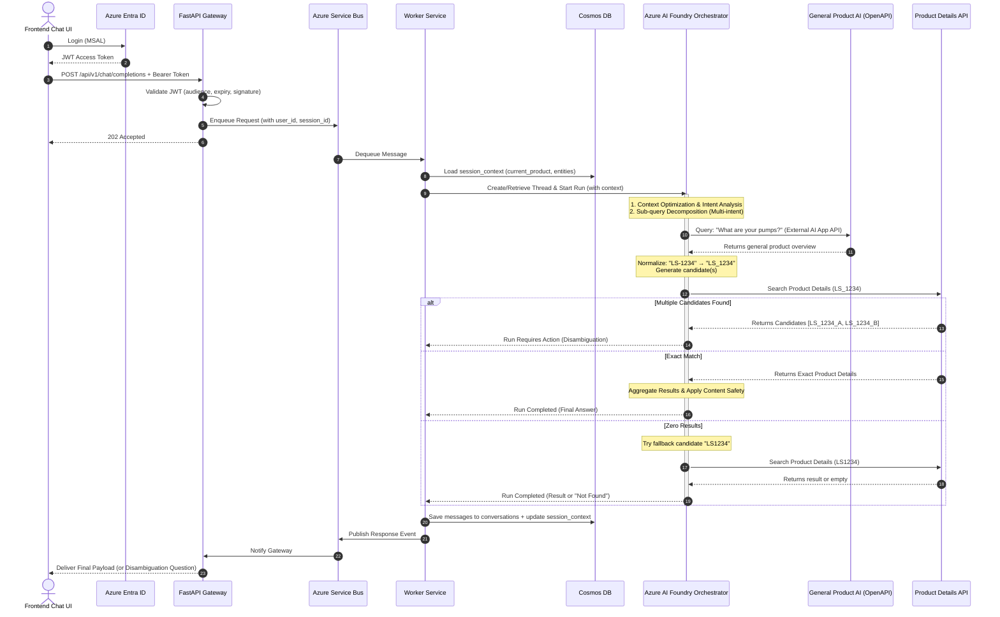

# Enterprise AI Assistant Implementation & Deployment Plan
## FastAPI Backend & Native Azure AI Foundry Agent Service Integration

**Version:** 5.0 (Enhanced with Authentication, Cost Analysis, Robust Normalization & Conversation State)  
**Architecture Baseline:** Queue-Based Execution via Azure Service Bus & Azure AI Foundry Agent Service  
**Deployment Target:** Azure App Services (FastAPI Gateway & Workers), Azure Service Bus, Azure AI Foundry, Azure Cosmos DB  

---

## 1. Executive Summary & Architectural Overview

This document outlines the end-to-end technical implementation and deployment plan for the **Enterprise AI Assistant Platform**. By adopting **Native Azure AI Foundry Agent Service**, the platform eliminates redundant custom orchestration services while retaining enterprise-grade queue-based scaling.

This plan addresses the following core requirements:
*   **Authentication & Authorization:** Azure Entra ID-based user login with JWT validation.
*   **Intent Analysis & Context Optimization:** Handling compound queries and maintaining optimized token context across conversation sessions.
*   **Part Number Normalization & Candidate Generation:** Automatically correcting user typos (spaces, hyphens) for part number prefixes (starting with "LS"), generating normalized candidates, and handling zero/multiple/exact match scenarios.
*   **Conversational Context:** Tracking the "current product" across follow-up questions within a session.
*   **Disambiguation Flows:** Prompting the user when a normalized part number returns multiple API candidates.
*   **External AI Integration:** Delegating general product queries to an existing company AI App (which uses its own AI model) exposed as an OpenAPI tool.
*   **Scalability from Day One:** Service Bus queue-based architecture with auto-scaling workers.

---

## 2. Authentication & Authorization

Users authenticate via **Azure Entra ID (formerly Azure Active Directory)** using the MSAL (Microsoft Authentication Library) flow.

### Authentication Flow
1.  **Frontend (React):** Integrates `@azure/msal-react` to initiate the login flow. User signs in via Azure Entra ID and receives an access token (JWT).
2.  **FastAPI Gateway:** Every incoming API request includes the JWT in the `Authorization: Bearer <token>` header. The Gateway validates the token signature, audience, and expiry against the Azure Entra ID tenant using the `python-jose` or `msal` library.
3.  **User Identity:** The validated JWT provides `user_id` (object ID) and tenant claims. These are passed downstream to associate conversation state in Cosmos DB.
4.  **No Custom Auth:** Zero custom user databases or password management — fully delegated to Azure Entra ID.

### Azure Configuration
*   Register the application in **Azure Entra ID → App Registrations**.
*   Configure API permissions and expose scopes as needed.
*   Use **Managed Identity** for service-to-service communication (Gateway → Service Bus, Workers → Cosmos DB, Workers → AI Foundry).

---

## 3. End-to-End Request Lifecycle

```text
+------------------+       +-------------------------+       +---------------------+
|  Frontend Chat   | ----> |  FastAPI Gateway App    | ----> |  Azure Service Bus  |
| (React / MSAL)   | <---- | (Auth, Session, Route)  |       |   (Queue / Scaling) |
+------------------+       +-------------------------+       +---------------------+
                                                                        |
+------------------+       +-------------------------+                  |
| Client Response  | <---- |  FastAPI Worker App     | <----------------+
| (SSE / WebSockets|       | (Dequeues & Orchestrates|
|   / SSE Poll)    |       +-------------------------+
+------------------+                    |
                                        v
                           +-----------------------------------+
                           | Azure AI Foundry Agent Service    |
                           |  - Intent Analysis & Orchestrator |
                           |  - Product Details API Tool       |
                           |  - External General AI API Tool   |
                           |  - Azure AI Content Safety        |
                           +-----------------------------------+
                                        |
                                        v
                           +-----------------------------------+
                           | Azure Cosmos DB (Serverless)      |
                           |  - Conversation History           |
                           |  - Session Context & Entities     |
                           +-----------------------------------+
```

---

## 4. Conversation State: Azure Cosmos DB Data Model

All conversation state is persisted in **Azure Cosmos DB (Serverless)** using a document-per-message model. This provides durable, queryable conversation history with natural partitioning by session.

### Container: `conversations`
**Partition Key:** `/session_id`

Each chat turn is stored as a separate document:

```json
{
    "id": "msg_uuid_001",
    "session_id": "sess_abc123",
    "user_id": "entra_object_id_xyz",
    "timestamp": "2026-07-27T01:45:00Z",
    "role": "user",
    "content": "What is the spec for LS-12345?",
    "metadata": {
        "detected_intents": ["part_lookup"],
        "normalized_part_numbers": ["LS_12345"],
        "resolved_product": "LS_12345_V2"
    }
}
```

### Container: `session_context`
**Partition Key:** `/session_id`

A single lightweight document per session tracking active entities:

```json
{
    "id": "ctx_sess_abc123",
    "session_id": "sess_abc123",
    "user_id": "entra_object_id_xyz",
    "current_product": {
        "part_number": "LS_12345_V2",
        "product_name": "Hydraulic Pump Assembly",
        "resolved_at": "2026-07-27T01:45:30Z"
    },
    "session_entities": ["LS_12345_V2", "LS_99001"],
    "created_at": "2026-07-27T01:40:00Z",
    "last_active_at": "2026-07-27T01:45:30Z",
    "turn_count": 5
}
```

### Why Cosmos DB Serverless
*   **Document model fits naturally:** Each chat message = one document. Sessions and context are naturally represented as JSON documents with `session_id` and `user_id` fields.
*   **No capacity planning:** Serverless auto-scales RU/s based on demand. No reserved throughput to manage.
*   **Cost-effective at low-medium traffic:** Pay only for consumed RUs (~$0.25 per 1M RUs). At low traffic this is significantly cheaper than a fixed-tier Redis instance.
*   **Queryable history:** SQL-like queries enable analytics, audit trails, and debugging (e.g., "show all conversations for user X in the last 7 days").
*   **No additional operational complexity:** Already part of the Azure ecosystem. Managed Identity access, automatic backups, no eviction policies to configure.

---

## 5. Core Logic: Agent Reasoning & Tool Calling

The core business logic occurs within the Azure AI Foundry Agent Service. The Orchestrator Agent is instructed with system prompts that mandate specific routing, normalization, and disambiguation behaviors.

### Step 5.1: Intent Analysis, Sub-Query Decomposition, & Context Optimization

1.  **Context Loading:** Before processing the new message, the Worker loads the `session_context` document from Cosmos DB to retrieve the current product context and session entities.
2.  **Context Optimization:** The Orchestrator dynamically prunes older conversation turns from the thread. Only the most recent N turns plus key session entities (previously discussed part numbers, the current product) are included in the context window to minimize token consumption.
3.  **Intent Analysis & Decomposition:** The Orchestrator Agent analyzes the user prompt to detect multiple intents. If a user asks a compound question (e.g., *"What general hydraulic products do you have, and what is the spec for LS - 12345?"*), the orchestrator decomposes this into two distinct sub-queries to be handled in parallel or sequence.

### Step 5.2: Tool Routing & Agent Reasoning

Based on the intent analysis, the Agent determines the correct execution path for each sub-query:

#### Path A: Exact or Suspected Part Number (Normalization & Candidate Generation)

1.  **Detection:** If the user query contains a string matching a known part number pattern (currently: prefix starting with "LS" followed by separators/digits), the Agent triggers normalization.

2.  **Normalization & Candidate Generation:**
    ```text
    Input examples: "LS - 12345", "LS-12345", "LS 12345", "ls_12345", "Ls12345"

    Step 1: Trim whitespace and uppercase the prefix → "LS-12345", "LS12345"
    Step 2: Replace all hyphens, spaces, and dots with underscores → "LS_12345"
    Step 3: Primary candidate = "LS_12345"
    Step 4: Call Product Details API with the primary candidate
    
    If zero results from primary candidate:
      - Generate fallback candidate by stripping ALL separators → "LS12345"
      - Retry Product Details API with fallback candidate
    
    If still zero results → respond: "I couldn't find a product matching 'LS_12345'. 
      Please verify the part number and try again."
    ```

3.  **Tool Invocation:** The Agent invokes the **Product Details API Tool** with the normalized candidate(s).

4.  **Result Handling:**
    *   **Exact Match (1 result):** The Agent consumes the JSON payload, formats the product specifications for the user, and updates `session_context.current_product` in Cosmos DB.
    *   **Multiple Hits:** The Agent pauses and formulates a clarifying question (e.g., *"I found multiple matches for LS_12345. Did you mean: 1) LS_12345_V1 — Hydraulic Pump, or 2) LS_12345_V2 — Hydraulic Motor?"*). The response is yielded back to the client for disambiguation.
    *   **Zero Results:** The Agent informs the user the part was not found and suggests verifying the part number.

#### Path B: General Product Inquiries (External AI Integration)

*   **Detection:** If the user asks about products ("What pumps do you sell?", "Tell me about your filtration lines") but *does not* provide a specific part number pattern.
*   **Tool Invocation (AI-to-AI Handoff):** The Agent invokes the **General Product AI App**, which is registered in Azure AI Foundry as an **OpenAPI Tool**. The external AI app uses its own AI model internally. The Orchestrator passes the natural language sub-query to this external API, waits for the response, and synthesizes it into the final user answer.

#### Path C: Follow-Up Questions (Conversational Context)

*   **Detection:** If the user asks a question that doesn't contain a part number but the `session_context` has a `current_product` set (e.g., user previously asked about `LS_12345_V2`, then asks *"What's the weight?"* or *"Is it compatible with model X?"*).
*   **Behavior:** The Agent automatically references the `current_product` from session context and either:
    *   Re-queries the Product Details API for additional attributes, or
    *   Answers from the already-cached product details in the conversation thread.
*   **Context Switch:** If the user explicitly asks about a different product or topic, the Agent updates `current_product` accordingly.

### Step 5.3: Result Aggregation & Content Safety

1.  **Synthesis:** The Orchestrator Agent combines the results from Paths A, B, and/or C (if the query was multi-intent) into a single, coherent conversational response.
2.  **Safety Verification:** The final aggregated response passes through **Azure AI Content Safety** policies to ensure compliance (no PII leakage, no harmful content) before the Run is marked as completed.
3.  **State Persistence:** The Worker writes the user message and assistant response as documents to the `conversations` container in Cosmos DB, and updates the `session_context` document with any new entities or product context changes.

---

## 6. Error Handling & Fallback Behavior

| Failure Scenario | Behavior |
|---|---|
| **Product Details API timeout/5xx** | Respond: *"I'm unable to retrieve product details right now. Please try again in a moment."* Log error for monitoring. |
| **External General AI API timeout/5xx** | Respond: *"I'm unable to access general product information at the moment. Please try again shortly."* |
| **Product Details API returns 0 results** | After trying primary + fallback candidates, respond: *"I couldn't find a product matching '[part_number]'. Please double-check the part number format."* |
| **Azure AI Foundry Agent error** | Worker catches the exception, responds with a generic error message, and logs the full error to Application Insights. |
| **Service Bus poison message** | Configure dead-letter queue (DLQ) with max delivery count = 3. Monitor DLQ for failed messages. |
| **Cosmos DB write failure** | Non-blocking — response is still delivered to user. Retry write with exponential backoff. Log failure. |

---

## 7. Sequence Diagram: Full Flow with Authentication & Disambiguation



---

## 8. System Prompt Configuration (Orchestrator Agent)

To enforce this reasoning behavior, the Azure AI Foundry Orchestrator Agent is configured with the following system instructions:

```text
You are an enterprise AI assistant for product and part inquiries.
Perform intent analysis on every user message. If a message contains multiple questions, 
answer all of them by invoking the appropriate tools.

ROUTING RULES:
1. PART NUMBER DETECTION: If the user query contains a string that appears to be a part number 
   (especially those starting with "LS"), you MUST normalize the string before searching:
   - Uppercase the prefix
   - Replace any spaces, hyphens, or dots with underscores
   - Example: "LS - 123" → "LS_123", "ls-456" → "LS_456"
   Use the `product_details_api` tool with the normalized part number.

2. CANDIDATE FALLBACK: If the `product_details_api` returns zero results with the normalized 
   candidate, retry by stripping ALL separators (e.g., "LS_123" → "LS123"). If still no results, 
   inform the user: "I couldn't find a product matching '[part_number]'. Please verify the part number."

3. DISAMBIGUATION: If the `product_details_api` returns multiple candidates, DO NOT guess. 
   Present all candidates with their names/descriptions and ask the user to clarify which one 
   they meant.

4. GENERAL PRODUCTS: If the user asks about general company products without a specific part 
   number, you MUST use the `general_product_ai_api` tool to get the answer.

5. FOLLOW-UP QUESTIONS: If the user asks a question without specifying a part number, check 
   the conversation context for a previously discussed product. If one exists, assume the user 
   is asking about that product unless they explicitly indicate otherwise.

6. CONTEXT SWITCH: If the user introduces a new part number or explicitly changes topic, update 
   your understanding of the "current product" accordingly.

CONTEXT RULES:
- Maintain a concise context window. Only include recent conversation turns and key session 
  entities (part numbers, resolved products) to minimize token usage.
- When referencing prior conversation, prioritize the most recently discussed product.

ERROR HANDLING:
- If any tool call fails or times out, inform the user with a helpful message and suggest 
  retrying. Do NOT fabricate product information.
- Never guess or hallucinate product specifications. Only report data returned by the tools.

SCOPE BOUNDARIES:
- You ONLY answer questions about company products and parts. For unrelated questions, 
  politely redirect: "I'm designed to help with product and part inquiries. How can I assist 
  you with our products?"
```

---

## 9. Scalability & Operational Strategy

### Auto-Scaling Architecture
*   **Worker Auto-Scaling:** Azure App Service (Worker Pool) scales horizontally based on the Azure Service Bus `ActiveMessageCount` metric. Configure scale rules: scale out when ActiveMessageCount > 10, scale in when < 2.
*   **Cosmos DB Serverless:** Auto-scales RU/s based on demand. No manual provisioning or capacity planning required. Maximum burst capacity of 5,000 RU/s by default (adjustable).
*   **Service Bus:** Standard tier supports up to 256 KB message size and topic/subscription patterns for future multi-tenant scenarios.

### Session Management
*   Conversation history is durably persisted in Cosmos DB (`conversations` container).
*   Active session context (current product, entities) is maintained in Cosmos DB (`session_context` container) and loaded by Workers at the start of each request.
*   Context is optimized during Intent Analysis — older turns are pruned from the AI Foundry thread while the full history remains queryable in Cosmos DB.

### Security
*   **Managed Identities** enforce passwordless access across the FastAPI Gateway, Service Bus, Azure AI Foundry, Cosmos DB, and external OpenAPI tools.
*   **Azure Entra ID** handles all user authentication. No custom credential storage.
*   **Azure AI Content Safety** filters all outbound responses.

### Monitoring & Observability
*   **Azure Application Insights:** Integrated with FastAPI Gateway and Workers for request tracing, error logging, and performance metrics.
*   **Service Bus Dead-Letter Queue (DLQ):** Monitor for poison messages and processing failures.
*   **Cosmos DB Metrics:** Track RU consumption, latency, and storage growth via Azure Monitor.

---

## 10. Cost Estimate (Monthly, Low-Medium Traffic)

| Service | Tier / SKU | Est. Monthly Cost |
|---|---|---|
| Azure App Service — Gateway | B1 (Basic) | ~$13 |
| Azure App Service — Worker Pool | B1 (Basic) × 1-2 instances | ~$13-26 |
| Azure AI Foundry (GPT-4o-mini) | Pay-as-you-go | ~$10-50 (usage-dependent) |
| Azure Cosmos DB | Serverless | ~$1-10 (usage-dependent) |
| Azure Service Bus | Standard | ~$10 + $0.05/100K ops |
| Azure Entra ID | Free tier (included with Azure) | $0 |
| Azure AI Content Safety | Free tier (1K calls/mo) | $0 |
| Azure Application Insights | Free tier (5 GB/mo) | $0 |
| **Total Estimate** | | **~$50-110/mo** |

> **Note:** Costs scale with usage. The above assumes low-medium traffic (~1,000-10,000 chat messages/month). For higher volumes, consider upgrading App Service to S1/P1v3 and monitoring Cosmos DB RU consumption.

---

## 11. Future Enhancements (Post-v1)

These items are intentionally deferred to keep v1 simple and evolvable:

*   **Additional Part Number Prefixes:** Extend the normalization regex to handle other prefixes (e.g., "HY_", "PMP_") as business needs emerge. The current architecture supports this via system prompt updates — no code changes required.
*   **Multi-Tenant Support:** Service Bus topics/subscriptions can partition traffic by tenant. Cosmos DB partition keys already support per-session isolation.
*   **Conversation Analytics:** Cosmos DB's queryable history enables dashboards for most-searched parts, common disambiguation scenarios, and user engagement metrics.
*   **Streaming Responses:** Upgrade from SSE poll to WebSocket streaming for real-time token-by-token output.
*   **Feedback Loop:** Allow users to rate responses, feeding data back into prompt optimization.
